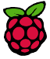
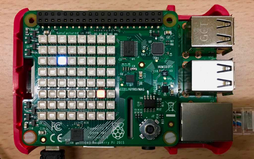

#  PongHAT


PongHAT is a Pong game running on a Raspberry Pi 3 using functionalities from the Sense
HAT.

<p align="center">
	
</p>

This game offers two modes:

- A first one, available during the first two levels where the player plays
against a wall.

- A second, from the third level, allowing artificial intelligence (AI) to
appear in the game, increasing the similarities with the traditional pong game.

**NOTE:** the speed of the game gradually increases with each game. Similarly,
it increases as you move to the next level.

---

### Installation

It's as simple as that:

```
pip install ponghat
```

---

### Usage

After being connected to the Raspberry using the Sense HAT and installed
`ponghat`, execute the following command to start a game:

```
ponghat
```

**NOTE:** if you don't have any Sense HAT, you can use a [Sense HAT
emulator](https://trinket.io/sense-hat).

---

### Contributions

There are many ways to contribute. For example, by submitting a bug by opening
an issue in the issue tracker, or by making a pull request. Ideas that can be
implemented is adding particles, refactoring code, etc.

---

### License

Code is under the [MIT License](https://github.com/rememberYou/pypong/blob/master/LICENSE).
